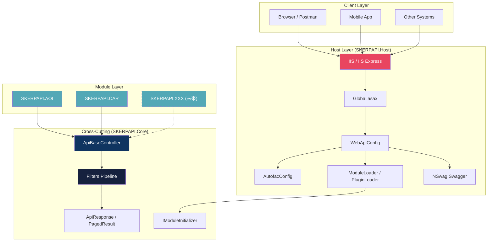
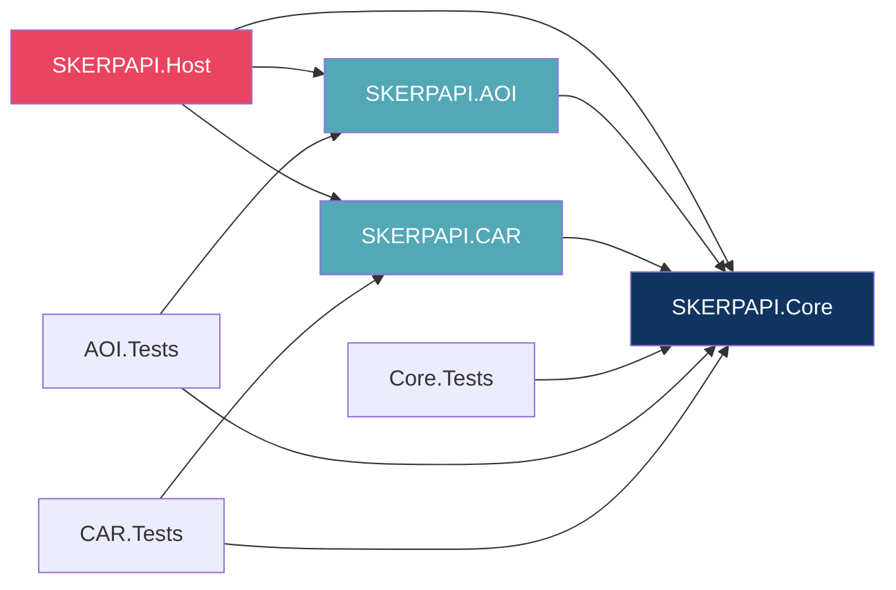
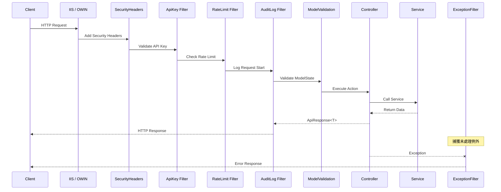
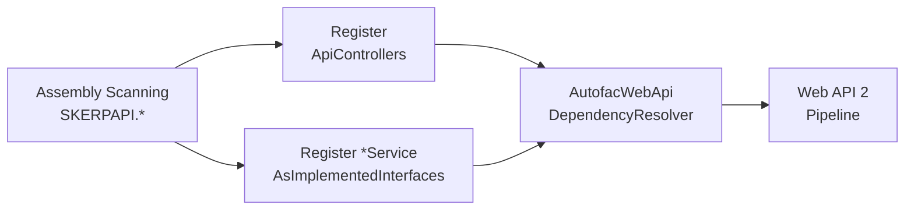
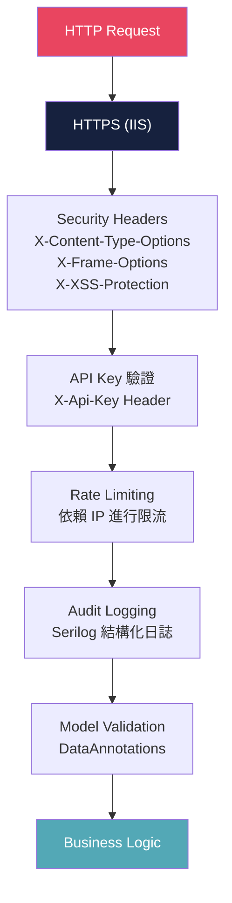
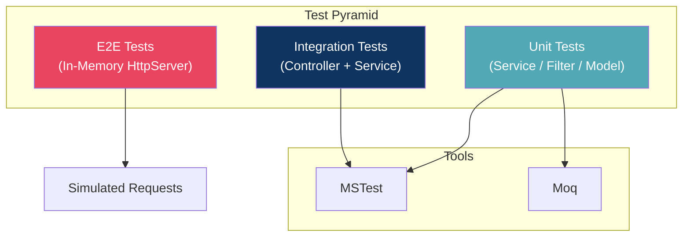
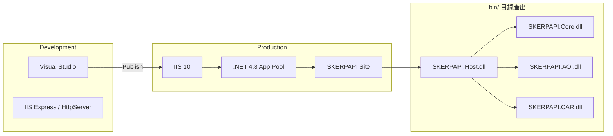

# SKERPAPI 系統架構設計文件

> **版本**: 1.0.0 | **最後更新**: 2026-04-07 | **適用對象**: 系統架構師

---

## 1. 架構理念與目標

### 1.1 設計理念 (Design Philosophy)
SKERPAPI 目標提供強固且容易橫向擴展（模組化）的 API 後台系統，同時保留 .NET Framework 的相容性與資產。
本架構實踐 **微內核設計模式 (Microkernel Architecture)**，包含一個核心基礎（Host + Core），並把實際商業邏輯分離至各別的外掛模組中。

### 1.2 系統目標

| 目標 | 說明 |
|---|---|
| **模組化** | 各業務系統 (AOI, CAR) 獨立專案開發，獨立版控，降低互相干擾 |
| **可擴充** | 新增模組只需建立 Class Library + 實作介面，系統自動掃描載入 |
| **統一治理** | 共用安全、日誌、標準化 ApiResponse 回應格式、全域例外處理 |
| **可測試** | 每層可獨立測試，Service / Controller 解耦，支援極速 E2E 測試 |

### 1.3 約束條件

| 約束 | 說明 |
|---|---|
| **.NET Framework 4.8** | 考量既有資產與相容性，不可使用 .NET 5+，但導入 SDK-style 專案檔 |
| **ASP.NET Web API 2** | 基於傳統 IIS 與 OWIN 架構，非 ASP.NET Core |
| **IIS 部署** | 傳統 IIS 架構 |
| **程式語言** | 全面拋棄 VB.NET，使用 C# 進行開發，增進編譯速度與維護性 |

---

## 2. 架構全覽

### 2.1 分層架構圖



### 2.2 核心元件與相依性規則
1. **Host 層 (`SKERPAPI.Host`)**:
   負責 API 的 Lifecycle，包括 OWIN / Web API 啟動、Autofac 相依注入掛載、Serilog 初始化，以及掃描動態加載。
2. **Core 層 (`SKERPAPI.Core`)**:
   所有模組共通引用的核心元件，絕不涉及商業邏輯。
3. **Module 層 (`SKERPAPI.AOI`, `SKERPAPI.CAR` 等)**:
   實作真正的領域邏輯，包含 Domain Models、Services 與 Web API Controllers。**不能** 互相依賴 (AOI 不能依賴 CAR)，只能依賴 Core。

### 2.3 專案依賴關係



---

## 3. 架構決策記錄 (ADR)

### ADR-001: 程式語言自 VB.NET 全數遷移至 C#
* **決策**: 以 C# 全面取代 VB.NET 開發，解決舊專案歷史包袱與語法維護不易的問題，並搭配 SDK-style `.csproj` 進行現代化管理。

### ADR-002: 多專案架構 vs 單層目錄結構
* **決策**: 採用 **多專案架構**。各模組可獨立 Build，減少團隊協作的 Merge Conflict。

### ADR-003: 模組引用策略 (ProjectReference vs Plugin DLL)
* **決策**: 目前階段選用 **ProjectReference** 以獲得最佳開發與偵錯體驗。Host 專案中內建 `ModuleLoader` 掃描邏輯，未來可無痛漸進式轉為從特定目錄動態讀取 (`App_Data/Plugins/`) 的 Plugin 模式。

### ADR-004: DI 容器選擇 Autofac
* **決策**: 採用 **Autofac**。支援強大的自動掃描 (Assembly Scanning)，自動為新加入的 Service 掛載於 DI 容器，完美整合 Web API 2 的 `InstancePerRequest` 生命週期。

### ADR-005: 採用 In-Memory E2E Test Server
* **決策**: E2E 測試導入 Web API 的 `HttpServer`，不綁定 Socket Port。解決 IIS Express 啟動延遲及 Port 佔用問題。

---

## 4. HTTP 請求處理管線



---

## 5. Autofac DI 策略

### 5.1 自動註冊機制



### 5.2 生命週期設定

| 生命週期 | 適用對象 | 說明 |
|---|---|---|
| `InstancePerRequest` | Service, Repository | 每個 HTTP 請求建立新實例，確保 Request 間資料隔離 |
| `SingleInstance` | Configuration, Logger | 整個應用程式共用單一實例 |
| `InstancePerDependency` | DTO, Factory | 每次注入都建立新實例 |

---

## 6. NSwag Swagger 分組架構

為了解決模組繁多導致 Swagger 介面擁擠，支援路由標籤自動分組：

| 方案 | 機制 | 開發階段 |
|---|---|---|
| **OpenApiTag** | 在 Controller 加入 `<OpenApiTag>` 手動標記 | **初期推薦** |
| **OperationProcessor** | 自訂 Processor 解析 URL 路徑自動設定 Tag | 未來導入 |

---

## 7. 全域 API 回應設計

採用統一的標準 `ApiResponse<T>` 包裝回應，並全面導向 **camelCase** 的 JSON Property Name。

```json
{
  "success": true,
  "data": { ... },
  "errorMessage": null,
  "traceId": "9c12df8b3a0f12...",
  "timestamp": "2026-04-07T00:00:00Z"
}
```

---

## 8. 安全控制架構



---

## 9. 品質保證與測試架構



| 測試類型 | 框架 | 目標 |
|---|---|---|
| **Unit Test** | MSTest + Moq | 驗證 Service 邏輯、Filter 行為。無外部依賴。 |
| **Integration Test** | MSTest | 驗證 Controller 呼叫 Service 之介面行為。 |
| **E2E Test** | In-Memory Host | 在記憶體中模擬真實 HTTP 管線，徹底黑箱驗證 API 路由與 JSON 回應。 |

---

## 10. 部署架構與可擴展性路線圖



### 10.1 路線圖 (Roadmap)

- [x] Phase 1: 多專案架構與 C# 遷移、Swagger 分組、單元測試基礎建設。
- [ ] Phase 2: 加入 Versioning、Entity Framework / Dapper、Redis 快取層。
- [ ] Phase 3: 切換至 Plugin 動態載入，加入 OAuth 2.0 / JWT 認證，籌備 .NET 6+ 遷移策略。
