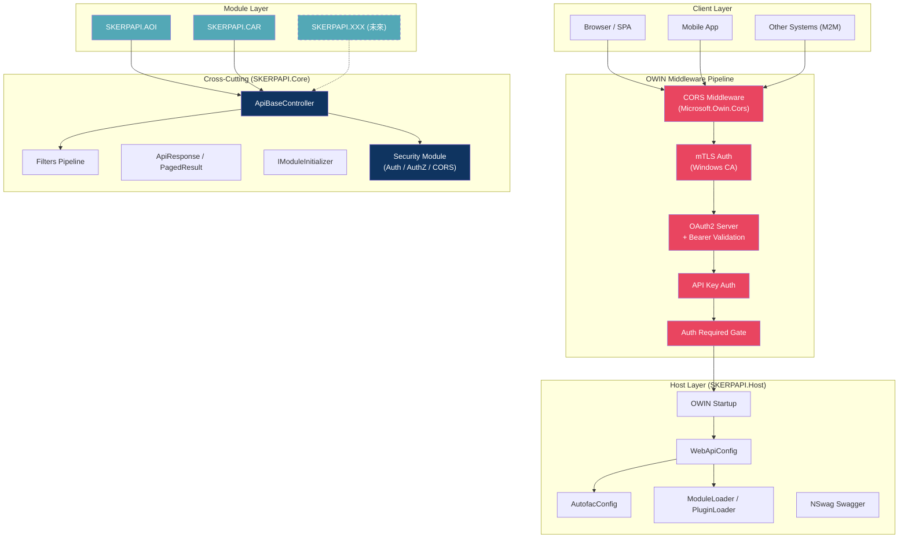
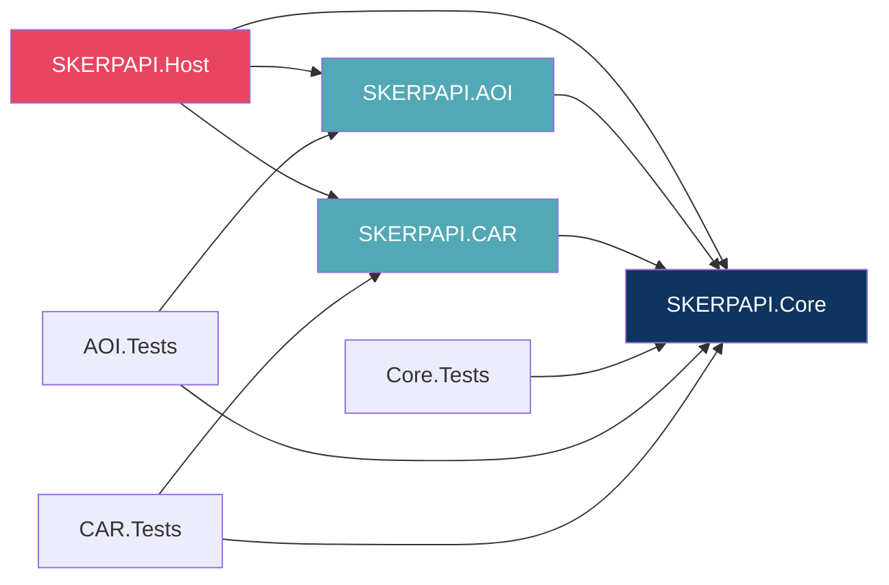
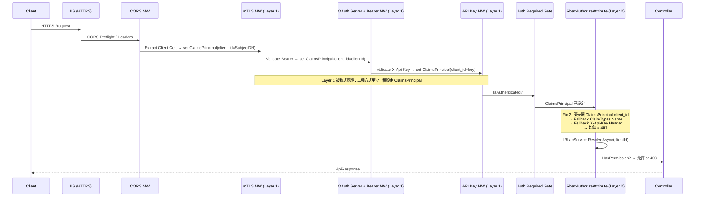
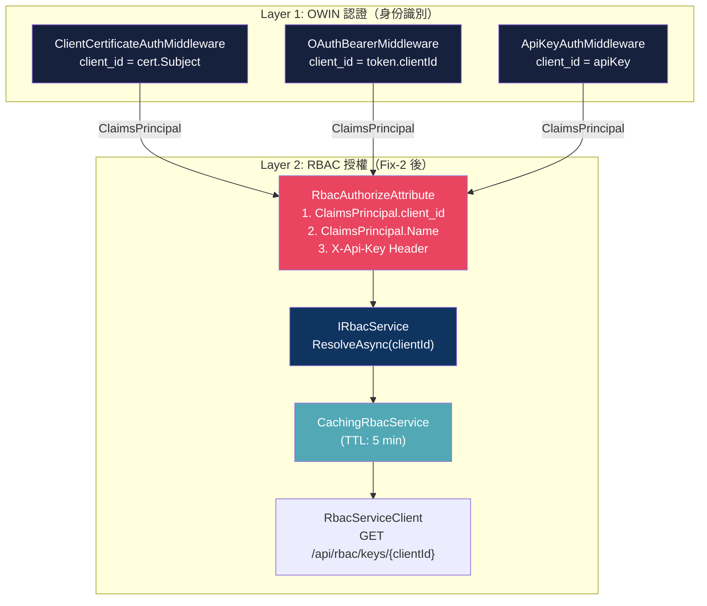
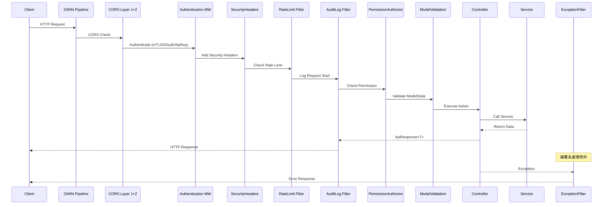
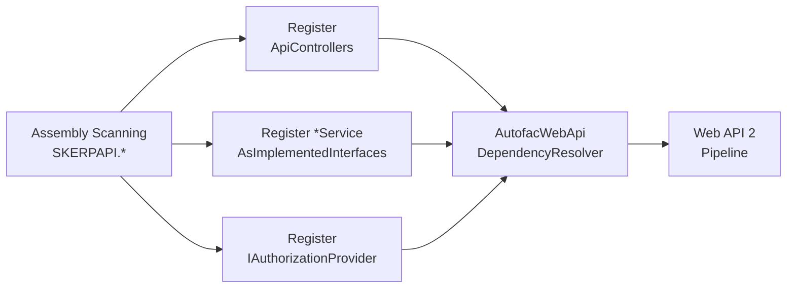

# SKERPAPI 系統架構設計文件

> **版本**: 2.2.0 | **最後更新**: 2026-04-30 | **適用對象**: 系統架構師

---

## 1. 架構理念與目標

### 1.1 設計理念 (Design Philosophy)
SKERPAPI 目標提供強固且容易橫向擴展（模組化）的 API 後台系統，同時保留 .NET Framework 的相容性與資產。
本架構實踐 **微內核設計模式 (Microkernel Architecture)**，包含一個核心基礎（Host + Core），並把實際商業邏輯分離至各別的外掛模組中。

### 1.2 系統目標

| 目標 | 說明 |
|---|---|
| **模組化** | 各業務系統 (AOI, CAR) 獨立專案開發，獨立版控，降低互相干擾 |
| **可擴充** | 新增模組只需建立 Class Library + 實作介面，系統自動掃描載入 |
| **統一治理** | 共用安全、日誌、標準化 ApiResponse 回應格式、全域例外處理 |
| **可測試** | 每層可獨立測試，Service / Controller 解耦，支援極速 E2E 測試 |
| **企業級安全** | 多策略認證 (mTLS / OAuth2 / API Key)、可插拔 RBAC 授權、CORS 雙層管理 |
| **API 版本管理** | 採用 `Asp.Versioning.WebApi` 7.x，支援 URL Segment / Query String / Header 三種版本讀取策略 |
| **API 版本管理** | 採用 `Asp.Versioning.WebApi` 7.x，支援 URL Segment / Query String / Header 三種版本讀取策略 |

### 1.3 約束條件

| 約束 | 說明 |
|---|---|
| **.NET Framework 4.8** | 考量既有資產與相容性，不可使用 .NET 5+，但導入 SDK-style 專案檔 |
| **ASP.NET Web API 2** | 基於傳統 IIS 與 OWIN 架構，非 ASP.NET Core |
| **IIS 部署** | 傳統 IIS 架構，支援 mTLS 需於 IIS SSL Settings 配置 |
| **程式語言** | 全面拋棄 VB.NET，使用 C# 進行開發 |
| **OWIN Pipeline** | 安全中介層基於 Microsoft Katana (OWIN 4.2.2)，統一認證/CORS 管線 |

---

## 2. 架構全覽

### 2.1 分層架構圖



### 2.2 核心元件與相依性規則
1. **OWIN Middleware Pipeline**: CORS → mTLS → OAuth2 → API Key → Auth Required。所有安全邏輯在此完成。
2. **Host 層 (`SKERPAPI.Host`)**: 負責 API 的 Lifecycle，包括 OWIN Startup、Autofac DI、Plugin 載入。
3. **Core 層 (`SKERPAPI.Core`)**: 所有模組共通引用的核心元件，包含安全模組（認證/授權/CORS）。
4. **Module 層 (`SKERPAPI.AOI`, `SKERPAPI.CAR` 等)**: 實作領域邏輯。不能互相依賴，只能依賴 Core。

### 2.3 專案依賴關係



---

## 3. 架構決策記錄 (ADR)

### ADR-001: 程式語言自 VB.NET 全數遷移至 C#
* **決策**: 以 C# 全面取代 VB.NET 開發，解決舊專案歷史包袱與語法維護不易的問題，並搭配 SDK-style `.csproj` 進行現代化管理。

### ADR-002: 多專案架構 vs 單層目錄結構
* **決策**: 採用 **多專案架構**。各模組可獨立 Build，減少團隊協作的 Merge Conflict。

### ADR-003: API 版本管理策略 (Asp.Versioning.WebApi)
* **決策**: 採用 **`Asp.Versioning.WebApi` 7.1.0** 進行 URL Segment 版本管理（`/v{version:apiVersion}/`）。服務層維持 v1 介面，Controller 層做版本適配（Adapter 模式）。Breaking change（欄位重命名/刪除）才建立新版本，Non-breaking change 維持舊版本。
* **關鍵設定**: `AddApiVersioning()` 必須在 `MapHttpAttributeRoutes()` 之前呼叫；需手動將 `ApiVersionRouteConstraint` 加入 `DefaultInlineConstraintResolver.ConstraintMap`。

### ADR-003: API 版本管理策略 (Asp.Versioning.WebApi)
* **決策**: 採用 **`Asp.Versioning.WebApi` 7.1.0** 進行 URL Segment 版本管理（`/v{version:apiVersion}/`）。服務層維持 v1 介面，Controller 層做版本適配（Adapter 模式）。Breaking change（欄位重命名/刪除）才建立新版本，Non-breaking change 維持舊版本。
* **關鍵設定**: `AddApiVersioning()` 必須在 `MapHttpAttributeRoutes()` 之前呼叫；需手動將 `ApiVersionRouteConstraint` 加入 `DefaultInlineConstraintResolver.ConstraintMap`。

### ADR-003b: 模組引用策略 (ProjectReference vs Plugin DLL)
* **決策**: 目前階段選用 **ProjectReference** 以獲得最佳開發與偵錯體驗。Host 專案中內建 `ModuleLoader` 掃描邏輯，未來可無痛漸進式轉為從特定目錄動態讀取 (`App_Data/Plugins/`) 的 Plugin 模式。

### ADR-004: DI 容器選擇 Autofac
* **決策**: 採用 **Autofac**。支援強大的自動掃描 (Assembly Scanning)，自動為新加入的 Service 掛載於 DI 容器，完美整合 Web API 2 的 `InstancePerRequest` 生命週期。

### ADR-005: 採用 In-Memory E2E Test Server
* **決策**: E2E 測試導入 Web API 的 `HttpServer`，不綁定 Socket Port。解決 IIS Express 啟動延遲及 Port 佔用問題。

### ADR-006: 安全管線從 ActionFilter 遷移至 OWIN Middleware
* **決策**: 認證（API Key / JWT Bearer / mTLS）全部遷移至 OWIN Middleware Pipeline，執行時機早於 Web API Pipeline。原因：
  1. 認證應在路由解析之前完成
  2. OWIN 層可處理 CORS preflight 和 OAuth token endpoint
  3. 統一的 `ClaimsPrincipal` 可在整個管線中共享

### ADR-007: 雙層 CORS 策略
* **決策**: 同時使用 `Microsoft.Owin.Cors`（Layer 1）和 `Microsoft.AspNet.WebApi.Cors`（Layer 2）。
  - Layer 1: OWIN 全域處理 preflight OPTIONS 請求
  - Layer 2: Web API `[EnableCors]` / `[DisableCors]` 做 Controller/Action 精細控制

### ADR-008: 可插拔授權架構 (IAuthorizationProvider)
* **決策**: 授權層以 `IAuthorizationProvider` 介面抽象，透過 Autofac DI 切換實作：
  - 開發環境: `ConfigBasedAuthProvider`（全部放行）
  - 正式環境: `DbRbacAuthProvider`（查詢 User-Role-Permission DB）
  - 未來擴充: `ActiveDirectoryAuthProvider`（對接 AD/LDAP）

### ADR-011: RBAC 服務客戶端（IRbacService + CachingDecorator）
* **決策**: 採用 Decorator 模式實作 RBAC 服務呼叫。`RbacServiceClient` 負責對外部 RBAC API HTTP 呼叫；`CachingRbacService` 在其外部加入記憶體快取層，降低對 RBAC API 的頻繁呼叫。
  - 快取 TTL 可透過 `RbacCacheTtlMinutes` 設定（預設 5 分鐘）
  - `RbacApiBaseUrl` / `RbacApiTimeoutSeconds` 設定於 Web.config
  - 兩層透過 Autofac Named Registration (`rbacClient`) 串接

### ADR-011: RBAC 服務客戶端（IRbacService + CachingDecorator）
* **決策**: 採用 Decorator 模式實作 RBAC 服務呼叫。`RbacServiceClient` 負責對外部 RBAC API HTTP 呼叫；`CachingRbacService` 在其外部加入記憶體快取層，降低對 RBAC API 的頻繁呼叫。
  - 快取 TTL 可透過 `RbacCacheTtlMinutes` 設定（預設 5 分鐘）
  - `RbacApiBaseUrl` / `RbacApiTimeoutSeconds` 設定於 Web.config
  - 兩層透過 Autofac Named Registration (`rbacClient`) 串接

### ADR-012: Layer 2 RBAC 身份識別優先順序（Fix-2）
* **背景**: `RbacAuthorizeAttribute`（Layer 2）原本僅讀取 `X-Api-Key` Header，完全忽略 OWIN Layer 1 設定的 `ClaimsPrincipal`，導致 OAuth 2.0 Bearer Token 及 mTLS 用戶端在通過 Layer 1 認證後，仍被 Layer 2 以 401 拒絕。
* **決策**: 修改 `RbacAuthorizeAttribute.OnActionExecutingAsync` 以 **ClaimsPrincipal 優先** 策略解析 `clientId`：
  1. 先讀 `ClaimsPrincipal.FindFirst("client_id")` — OAuth Bearer / mTLS 的主要身份識別
  2. Fallback `ClaimsPrincipal.FindFirst(ClaimTypes.Name)` — 備用 Name Claim
  3. 再 Fallback `X-Api-Key` Header — 向後相容舊版 API Key 用戶端
  4. 三者均為空 → 401 Unauthorized
* **影響**: `RbacServiceClient.ResolveAsync(clientId, ...)` 的參數語意從「API Key 字串」擴展為「客戶端識別碼」（可以是 clientId、cert Subject DN、或 API Key）。RBAC 後端需能以相同查詢介面處理三種身份形式。
* **取捨**: mTLS 用戶端的 `clientId` 為憑證完整 Subject DN（例如 `CN=Robot01,O=Corp`），RBAC 後端需對此格式進行正規化或白名單比對（見 Gap M-5）。
* **TDD 驗證**: 測試案例 Test 6（OAuth）與 Test 7（mTLS）在實作前為 RED，實作後為 GREEN；Test 8 為迴歸測試確保匿名請求仍返回 401。

### ADR-009: OAuth2 過渡策略
* **決策**: 當前階段使用 `OAuthAuthorizationServerMiddleware` 自建 Token 端點 (`/api/token`)。
  - 支援 `client_credentials` 和 `password` grant type
  - 未來遷移至外部 IdP 時，僅需移除 Server 配置，保留 Bearer Token 驗證
  - 切換空間保留在 `Startup.cs` 中，修改一行即可

### ADR-010: mTLS 支援 Windows CA
* **決策**: mTLS 憑證驗證使用 Windows Certificate Store 的 Chain Validation，支援企業內部 Windows CA 簽發的憑證。
  - IIS 配置 "Accept" 或 "Require" Client Certificates
  - 可選設定受信任的 Issuer DN 白名單
  - 被動模式：未攜帶憑證不拒絕（除非設定 `Security:MtlsRequired=true`）

---

## 4. 安全架構

### 4.1 OWIN 認證管線

> **Fix-2 更新**：RbacAuthorizeAttribute（Layer 2）現已優先讀取 OWIN Layer 1 設定的 `ClaimsPrincipal`，再向後相容地回退至 `X-Api-Key` Header。



### 4.2 認證策略矩陣

| 認證方式 | 適用場景 | 執行層級 | 套件 |
|---|---|---|---|
| **mTLS** | M2M 系統串接、工廠設備通訊 | OWIN MW + IIS SSL | 內建 Windows CA Chain |
| **OAuth2 Bearer** | SPA 前端、Mobile App、第三方 | OWIN MW | Microsoft.Owin.Security.OAuth |
| **API Key** | 內部工具、開發/測試環境 | OWIN MW | 自建 Middleware |

### 4.3 授權架構 (RBAC)

> **Fix-2 更新**：`RbacAuthorizeAttribute` 身份識別優先順序已更新，現在支援三種 Layer 1 認證方式。



#### clientId 解析優先順序（Fix-2 實作後）

| 優先順序 | 來源 | 適用認證方式 | Claim 類型 |
|---|---|---|---|
| 1 | `ClaimsPrincipal.FindFirst("client_id")` | OAuth Bearer、mTLS、API Key | `SecurityConstants.ClientIdClaimType` |
| 2 | `ClaimsPrincipal.FindFirst(ClaimTypes.Name)` | 備用 Name Claim | `System.Security.Claims.ClaimTypes.Name` |
| 3 | `X-Api-Key` Header | 舊版 API Key 向後相容 | HTTP Header |
| 4 | 均無 | — | → **401 Unauthorized** |

#### 權限代碼命名慣例
```
{module}:{resource}:{action}
```

| 範例 | 意義 |
|---|---|
| `aoi:workorder:create` | AOI 模組 - 工單 - 建立 |
| `car:vehicle:read` | CAR 模組 - 車輛 - 讀取 |
| `admin:config:write` | 管理 - 設定 - 寫入 |
| `aoi:*:read` | AOI 模組 - 所有資源 - 讀取 (萬用字元) |

### 4.4 CORS 雙層策略

| 層級 | 套件 | 職責 |
|---|---|---|
| **Layer 1 (OWIN)** | `Microsoft.Owin.Cors` | 全域 preflight OPTIONS 處理、白名單 Origin 驗證 |
| **Layer 2 (Web API)** | `Microsoft.AspNet.WebApi.Cors` | Controller/Action 精細控制：`[EnableCors]`, `[DisableCors]` |

### 4.5 NuGet 安全套件清單

| 套件 | 版本 | License | 用途 |
|---|---|---|---|
| Microsoft.Owin | 4.2.2 | Apache-2.0 | OWIN 核心 |
| Microsoft.Owin.Host.SystemWeb | 4.2.2 | Apache-2.0 | IIS 整合 |
| Microsoft.Owin.Security | 4.2.2 | Apache-2.0 | 安全基礎設施 |
| Microsoft.Owin.Security.OAuth | 4.2.2 | Apache-2.0 | OAuth2 Server + Bearer |
| Microsoft.Owin.Security.Jwt | 4.2.2 | Apache-2.0 | JWT 驗證 (預留) |
| Microsoft.Owin.Cors | 4.2.2 | Apache-2.0 | OWIN CORS |
| Microsoft.AspNet.WebApi.Cors | 5.3.0 | Apache-2.0 | Web API CORS |
| Microsoft.AspNet.WebApi.Owin | 5.3.0 | Apache-2.0 | Web API OWIN 整合 |
| System.IdentityModel.Tokens.Jwt | 8.0.1 | MIT | JWT Token 處理 |

> 全部套件皆為免費可商用授權。

---

## 5. HTTP 請求處理管線



---

## 6. Autofac DI 策略

### 6.1 自動註冊機制



### 6.2 生命週期設定

| 生命週期 | 適用對象 | 說明 |
|---|---|---|
| `InstancePerRequest` | Service, Repository | 每個 HTTP 請求建立新實例 |
| `SingleInstance` | Configuration, Logger, IAuthorizationProvider | 整個應用程式共用 |
| `InstancePerDependency` | DTO, Factory | 每次注入都建立新實例 |

---

## 7. NSwag Swagger 分組架構

| 方案 | 機制 | 開發階段 |
|---|---|---|
| **OpenApiTag** | 在 Controller 加入 `<OpenApiTag>` 手動標記 | **初期推薦** |
| **OperationProcessor** | 自訂 Processor 解析 URL 路徑自動設定 Tag | 未來導入 |

---

## 8. 全域 API 回應設計

採用統一的標準 `ApiResponse<T>` 包裝回應，全面導向 **camelCase** 的 JSON Property Name。

```json
{
  "success": true,
  "data": { ... },
  "errorMessage": null,
  "traceId": "9c12df8b3a0f12...",
  "timestamp": "2026-04-18T00:00:00Z"
}
```

---

## 9. 品質保證與測試架構

| 測試類型 | 框架 | 數量 | 目標 |
|---|---|---|---|
| **Unit Test** | MSTest + Moq | 76 | Service / Filter / Security / RBAC / Versioning 邏輯 |
| **Integration Test** | MSTest | — | Controller + Service 介面行為 |
| **E2E Test** | In-Memory Host | 21 | 完整 HTTP Pipeline 黑箱驗證（含 v1/v2 版本路由）|

---

## 10. 部署架構與路線圖

### 10.1 路線圖 (Roadmap)

- [x] Phase 1: 多專案架構與 C# 遷移、Swagger 分組、單元測試基礎建設
- [x] Phase 2: 安全架構 — 多策略認證 (mTLS/OAuth2/API Key)、CORS 雙層管理、可插拔 RBAC
- [x] Phase 3: API Versioning (Asp.Versioning.WebApi 7.x)、RBAC 服務客戶端 (IRbacService + CachingDecorator)
- [ ] Phase 4: Entity Framework / Dapper、Redis 快取層、切換至外部 IdP (Azure AD / Keycloak)
- [ ] Phase 5: 籌備 .NET 6+ 遷移策略
