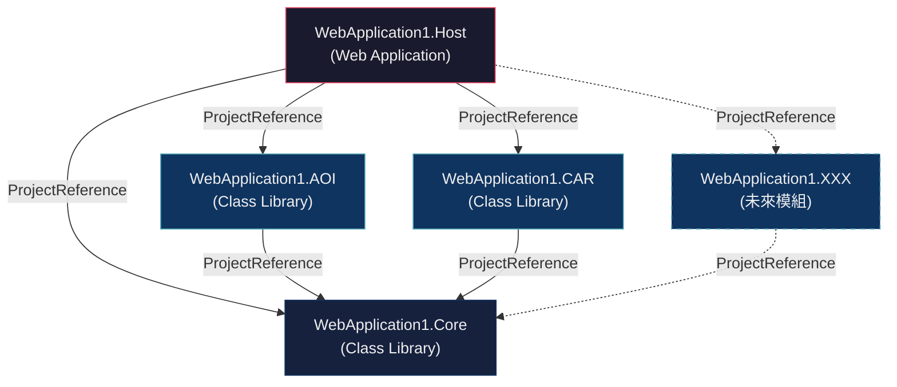

# 企業級 Web API 系統架構規劃

**目標**：基於 .NET Framework 4.8 + ASP.NET Web API 2，將各業務系統（AOI、CAR 等）拆分為**獨立 Class Library 專案**，由一個 Host 專案統一載入，達成「系統別獨立開發、統一部署」的架構目標。

---

## 現狀分析

目前的 `WebApplication1` 是一個**單體專案 (Monolith)**，所有系統的 Controller 都放在同一個 `.vbproj` 裡的 `Modules/` 資料夾下：

| 已有元素 | 評估 |
|---|---|
| `Modules/IModuleInitializer.vb` | ✅ 良好的模組介面設計，可保留升級 |
| `App_Start/ModuleLoader.vb` | ✅ 掃描 Assembly 載入模組，核心邏輯正確 |
| `Controllers/ApiBaseController.vb` | ✅ 統一驗證與回應，可抽至共用層 |
| `Models/ApiResponse.vb`, `ApiError.vb` | ✅ 統一回應模型，應抽至共用層 |
| `Filters/*` | ✅ 安全/審計/限速過濾器，應抽至共用層 |
| `Modules/AOI/`, `Modules/CAR/` | ⚠️ 目前僅是資料夾，非獨立專案 |

> [!IMPORTANT]
> 核心問題：AOI 和 CAR 目前是**資料夾**而非**獨立專案**，無法做到獨立編譯、獨立版本管理、獨立團隊開發。需重構為獨立 Class Library。

---

## 提案架構

### Solution 全覽

```
WebApplication1.sln
│
├── src/
│   ├── WebApplication1.Host/              ← Web Application (唯一的 Host，部署入口)
│   │   ├── App_Start/
│   │   │   ├── WebApiConfig.vb
│   │   │   ├── ModuleLoader.vb            ← 增強版：掃描 bin/ 下所有模組 DLL
│   │   │   ├── DependencyConfig.vb        ← Unity/Autofac DI 容器配置
│   │   │   ├── SerilogConfig.vb
│   │   │   └── OpenTelemetryConfig.vb
│   │   ├── Global.asax / Global.asax.vb
│   │   ├── Web.config
│   │   └── WebApplication1.Host.vbproj
│   │
│   ├── WebApplication1.Core/              ← Class Library (共用基礎設施)
│   │   ├── Controllers/
│   │   │   └── ApiBaseController.vb
│   │   ├── Models/
│   │   │   ├── ApiResponse.vb
│   │   │   ├── ApiError.vb
│   │   │   └── PagedResult.vb             ← [NEW] 分頁模型
│   │   ├── Filters/
│   │   │   ├── ApiExceptionFilter.vb
│   │   │   ├── ApiKeyAttribute.vb
│   │   │   ├── RateLimitAttribute.vb
│   │   │   ├── SecurityFilters.vb
│   │   │   └── ModelValidationFilter.vb   ← [NEW] 自動 ModelState 驗證
│   │   ├── Modules/
│   │   │   └── IModuleInitializer.vb
│   │   ├── Extensions/
│   │   │   └── HttpConfigurationExtensions.vb  ← [NEW] 共用擴展方法
│   │   └── WebApplication1.Core.vbproj
│   │
│   ├── WebApplication1.AOI/               ← Class Library (AOI 系統專案)
│   │   ├── Controllers/
│   │   │   └── V1/
│   │   │       ├── AOI01Controller.vb
│   │   │       └── AOI02Controller.vb
│   │   ├── Models/
│   │   │   └── AOIInspectionResult.vb
│   │   ├── Services/
│   │   │   ├── IAOIService.vb
│   │   │   └── AOIService.vb
│   │   ├── AOIModuleInitializer.vb
│   │   └── WebApplication1.AOI.vbproj     ← 參考 Core，不參考 Host
│   │
│   ├── WebApplication1.CAR/               ← Class Library (CAR 系統專案)
│   │   ├── Controllers/
│   │   │   └── V1/
│   │   │       ├── CAR01Controller.vb
│   │   │       └── CAR02Controller.vb
│   │   ├── Models/
│   │   │   └── CarRegistrationDto.vb
│   │   ├── Services/
│   │   │   ├── ICARService.vb
│   │   │   └── CARService.vb
│   │   ├── CARModuleInitializer.vb
│   │   └── WebApplication1.CAR.vbproj     ← 參考 Core，不參考 Host
│   │
│   └── (未來擴充: WebApplication1.MES/, WebApplication1.WMS/, ...)
│
├── tests/
│   ├── WebApplication1.Core.Tests/
│   ├── WebApplication1.AOI.Tests/
│   └── WebApplication1.CAR.Tests/
│
└── WebApplication1.sln
```

### 專案依賴關係圖



---

## 架構細節說明

### 1. WebApplication1.Core（共用基礎設施層）

此專案是所有模組的**唯一共用依賴**，包含：

| 類別 | 功能 |
|---|---|
| `ApiBaseController` | 統一回應格式（`ApiOk` / `ApiFail`）、統一驗證、基礎 Attribute |
| `IModuleInitializer` | 模組初始化介面 |
| `ApiResponse<T>` | 統一回應模型 + `PagedResult<T>` 分頁 |
| `Filters/*` | 安全標頭、審計日誌、例外處理、API Key 驗證、限速 |
| `Extensions/` | HTTP Configuration 擴展方法 |

> [!TIP]
> Core 層**不應參考任何模組專案**（AOI/CAR），保持單向依賴，避免循環引用。

### 2. 模組專案（AOI / CAR / ...）

每個模組是一個獨立的 **Class Library (.NET Framework 4.8)**：

```
WebApplication1.AOI.vbproj
├── 參考: WebApplication1.Core (ProjectReference)
├── 參考: System.Web.Http (NuGet: Microsoft.AspNet.WebApi.Core)
├── 不可參考: WebApplication1.Host
└── 不可參考: 其他模組專案 (AOI 不引用 CAR)
```

#### Controller 路由規範

```vb
Namespace Controllers.V1
    ' 路由格式: webapi/{系統別}/v{版本}/{功能別}
    <RoutePrefix("webapi/aoi/v1/aoi01")>
    Public Class AOI01Controller
        Inherits ApiBaseController   ' ← 繼承自 Core

        <HttpGet, Route("status")>
        Public Function GetStatus() As IHttpActionResult
            Return ApiOk(New With {.System = "AOI", .Status = "Online"})
        End Function
    End Class
End Namespace
```

#### URL 路由命名規範

| 路由模式 | 範例 | 說明 |
|---|---|---|
| `webapi/{sys}/v{ver}/{func}` | `webapi/aoi/v1/aoi01/status` | 標準端點 |
| `webapi/{sys}/v{ver}/{func}/{id}` | `webapi/car/v1/car01/12345` | 帶參數端點 |
| `webapi/{sys}/v{ver}/{func}/{action}` | `webapi/aoi/v1/aoi02/inspect` | 動作端點 |

#### ModuleInitializer 實作

```vb
Public Class AOIModuleInitializer
    Implements IModuleInitializer

    Public ReadOnly Property ModuleName As String = "AOI"

    Public Sub Initialize(config As HttpConfiguration)
        ' 1. 註冊 AOI 專屬的 DI 服務
        ' 2. 註冊 AOI 專屬的 Filter / Handler
        ' 3. 任何模組級別的配置
        Serilog.Log.Information("AOI Module v1.0 initialized.")
    End Sub
End Class
```

### 3. WebApplication1.Host（部署入口）

Host 專案負責：
- **組裝**：透過 ProjectReference 引用所有模組
- **啟動**：Global.asax → WebApiConfig → ModuleLoader
- **配置**：Web.config、DI 容器、NSwag/Swagger

#### 增強版 ModuleLoader

```vb
Public Module ModuleLoader
    Public Sub LoadModules(config As HttpConfiguration)
        Dim baseType = GetType(IModuleInitializer)
        
        ' 1. 掃描所有已載入的 Assembly（因為 ProjectReference，模組 DLL 會自動在 bin/ 下）
        Dim assemblies = AppDomain.CurrentDomain.GetAssemblies()
        
        ' 2. 也掃描 bin/ 下尚未載入的 DLL（支援未來的 plugin-style 載入）
        Dim binPath = HttpContext.Current.Server.MapPath("~/bin")
        For Each dllPath In Directory.GetFiles(binPath, "WebApplication1.*.dll")
            Dim asmName = AssemblyName.GetAssemblyName(dllPath)
            If Not assemblies.Any(Function(a) a.GetName().Name = asmName.Name) Then
                assemblies = assemblies.Concat({Assembly.Load(asmName)}).ToArray()
            End If
        Next
        
        ' 3. 尋找並執行 IModuleInitializer
        For Each assembly In assemblies
            Dim moduleTypes = assembly.GetTypes().
                Where(Function(t) baseType.IsAssignableFrom(t) _
                    AndAlso Not t.IsInterface _
                    AndAlso Not t.IsAbstract)
            
            For Each moduleType In moduleTypes
                Try
                    Dim instance = DirectCast(Activator.CreateInstance(moduleType), IModuleInitializer)
                    instance.Initialize(config)
                    Log.Information("Module loaded: {ModuleName}", instance.ModuleName)
                Catch ex As Exception
                    Log.Error(ex, "Failed to load module: {TypeName}", moduleType.FullName)
                End Try
            Next
        Next
    End Sub
End Module
```

### 4. NSwag / Swagger 配置

NSwag 會自動掃描所有 Controller（包括模組專案中的），因此不需額外配置。只需確保 Host 專案有安裝 `NSwag.AspNet.WebApi`。

> [!NOTE]
> 若希望按系統別分組 Swagger 文件，可使用 NSwag 的 `ApiGroupNames` 或自訂 `IOperationProcessor` 來按 RoutePrefix 前綴分組。

### 5. DI (Dependency Injection) 策略

推薦使用 **Unity** 或 **Autofac** 作為 DI 容器：

```vb
' DependencyConfig.vb (Host 專案)
Public Module DependencyConfig
    Public Sub Register(config As HttpConfiguration)
        Dim container = New UnityContainer()
        
        ' Core 層服務
        container.RegisterType(Of IItemService, ItemService)()
        
        ' 各模組在 ModuleInitializer 中自行註冊
        ' （或透過 Assembly Scanning 自動註冊）
        
        config.DependencyResolver = New UnityDependencyResolver(container)
    End Sub
End Module
```

---

## 建議的 NuGet 套件策略

| 專案 | 必要 NuGet 套件 |
|---|---|
| **Core** | `Microsoft.AspNet.WebApi.Core`, `Newtonsoft.Json`, `Serilog` |
| **各模組 (AOI/CAR)** | 繼承 Core 的依賴即可，依需求加裝專屬套件 |
| **Host** | `Microsoft.AspNet.WebApi.WebHost`, `NSwag.AspNet.WebApi`, `Unity.WebAPI` (或 Autofac), `OpenTelemetry.*`, `Serilog.Sinks.*` |

---

## 跨模組關注點 (Cross-Cutting Concerns)

```mermaid
flowchart LR
    Request["HTTP Request"] --> SecurityHeaders["Security Headers<br/>(Core Filter)"]
    SecurityHeaders --> ApiKey["API Key 驗證<br/>(Core Filter)"]
    ApiKey --> RateLimit["Rate Limiting<br/>(Core Filter)"]
    RateLimit --> AuditLog["Audit Log<br/>(Core Filter)"]
    AuditLog --> Controller["Module Controller<br/>(AOI/CAR)"]
    Controller --> ExceptionFilter["Exception Filter<br/>(Core Filter)"]
    ExceptionFilter --> Response["HTTP Response<br/>(ApiResponse&lt;T&gt;)"]
    
    style Request fill:#e94560,color:#fff
    style Response fill:#53a8b6,color:#fff
    style Controller fill:#0f3460,color:#fff
```



所有 Filter 定義在 Core 層，透過 `ApiBaseController` 上的 Attribute 或 WebApiConfig 的全域註冊生效。模組專案無需重複定義。

---

## User Review Required

> [!IMPORTANT]
> **方案選擇：ProjectReference vs Plugin DLL**
> 
> 本方案建議使用 **ProjectReference（編譯時綁定）** 而非 **Plugin 式動態載入**。原因：
> - .NET Framework 4.8 下 Plugin 技術（MEF / AppDomain / Assembly.Load）較複雜且有版本衝突風險
> - ProjectReference 在 Visual Studio 中開發體驗最佳（IntelliSense、偵錯、重構皆支援）
> - 各模組仍是**獨立的 .vbproj**，可獨立編譯測試
> 
> 如果您希望未來可以「不重新編譯 Host 就載入新模組 DLL」，請告知，我會調整為 Plugin 架構。

> [!IMPORTANT]
> **開發語言確認**
> 
> 目前專案使用 **VB.NET**。本計畫將繼續使用 VB.NET。如果您希望新模組改用 **C#**（同一 Solution 可混合語言），請告知。

> [!WARNING]
> **DI 容器選擇**
> 
> 推薦使用 **Unity** 或 **Autofac**。兩者比較：
> - **Unity**：微軟官方出品，與 Web API 2 整合最簡便 (`Unity.WebAPI` 套件)
> - **Autofac**：社群活躍，功能更豐富（Module scanning、Lifetime scope 等）
> 
> 請選擇偏好的 DI 容器。未指定將預設使用 **Unity**。

---

## 新增模組的 SOP

未來要新增一個系統（例如 `MES`），只需：

1. **新建 Class Library 專案** `WebApplication1.MES`
2. **加入 ProjectReference** → `WebApplication1.Core`
3. **建立 Controller**：`Controllers/V1/MES01Controller.vb` + `<RoutePrefix("webapi/mes/v1/mes01")>`
4. **建立 ModuleInitializer**：實作 `IModuleInitializer`
5. **Host 加入 ProjectReference** → `WebApplication1.MES`
6. **編譯即完成**，ModuleLoader 會自動發現並載入

---

## 實作步驟

### Phase 1: 建立 Solution 結構
- [ ] 重建 `.sln` 解決方案，加入 Solution Folders (`src/`, `tests/`)
- [ ] 建立 `WebApplication1.Core` Class Library 專案
- [ ] 建立 `WebApplication1.AOI` Class Library 專案
- [ ] 建立 `WebApplication1.CAR` Class Library 專案
- [ ] 將現有 Host 專案重新命名為 `WebApplication1.Host`

### Phase 2: 遷移共用程式碼至 Core
- [ ] 移動 `ApiBaseController`, `ApiResponse`, `ApiError`, `PagedResult` 至 Core
- [ ] 移動所有 `Filters` 至 Core
- [ ] 移動 `IModuleInitializer` 至 Core
- [ ] 安裝 Core 所需 NuGet 套件

### Phase 3: 遷移模組程式碼
- [ ] 移動 AOI Controller 與 ModuleInitializer 至 `WebApplication1.AOI`
- [ ] 移動 CAR Controller 至 `WebApplication1.CAR`，建立 CARModuleInitializer
- [ ] 設定各模組的 ProjectReference → Core
- [ ] 設定 Host 的 ProjectReference → AOI, CAR

### Phase 4: 安裝 DI 容器 & 強化配置
- [ ] 安裝 Unity (或 Autofac)
- [ ] 配置 `DependencyConfig.vb`
- [ ] 強化 `ModuleLoader.vb`（bin 掃描）

### Phase 5: 驗證
- [ ] 編譯整個 Solution
- [ ] 啟動 Host，驗證所有路由正常運作
- [ ] 驗證 Swagger UI 正確顯示所有模組的 API
- [ ] 驗證 Serilog 與 OpenTelemetry 正常運作

---

## Open Questions

> [!IMPORTANT]
> 1. **是否需要動態 Plugin 載入？** 還是 ProjectReference 編譯時綁定即可？
> 2. **DI 容器選 Unity 還是 Autofac？**
> 3. **是否需要 API Versioning 套件**（`Microsoft.AspNet.WebApi.Versioning`）做正式的版本管理，還是目前的 URL path 版本（`/v1/`）就夠用？
> 4. **是否要在這次重構中直接支援 C# 模組**，還是全部維持 VB.NET？
> 5. **測試專案是否需要一併建立？** 還是先建結構後續再補？

---

## Verification Plan

### Automated Tests
- `msbuild WebApplication1.sln /t:Build` — 確認整個 Solution 可編譯
- 啟動 Host 後用 curl/Postman 測試：
  - `GET webapi/aoi/v1/aoi01/status` → 200 OK
  - `GET webapi/car/v1/car01/info` → 200 OK
  - `GET /swagger` → Swagger UI 載入正常

### Manual Verification
- Visual Studio 中確認各專案的參考關係正確
- 確認新增模組 SOP 可順利執行（新增一個 dummy 模組測試流程）
