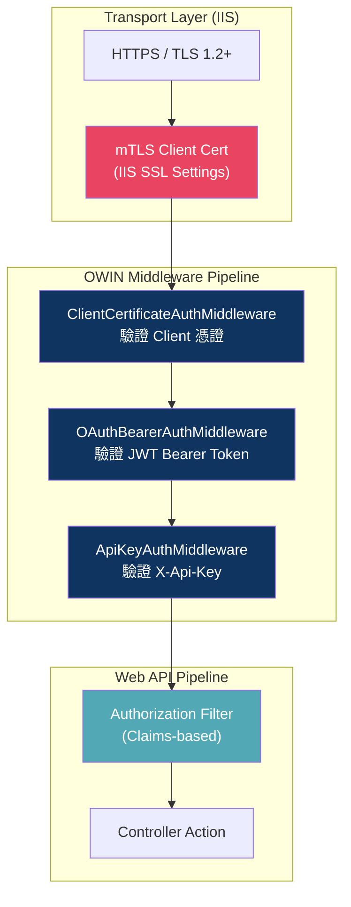
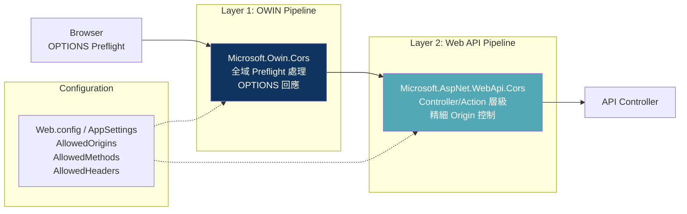
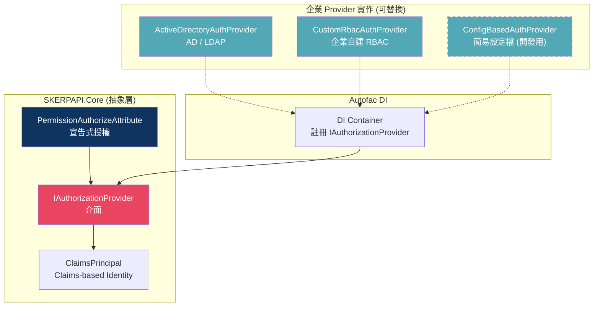
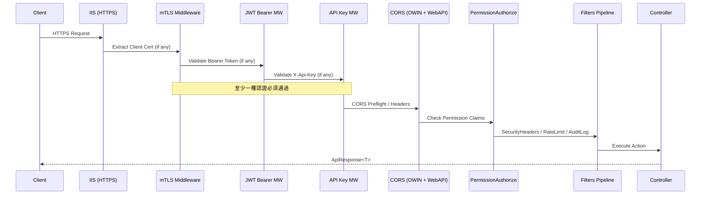

# SKERPAPI 安全架構評估與實作計畫

> **評估版本**: 2.0.0 | **評估日期**: 2026-04-18 | **角色**: 資深系統架構師

---

## 0. 評估摘要

針對 SKERPAPI 現有架構（.NET Framework 4.8 / ASP.NET Web API 2 / OWIN / Autofac / 微內核 Plugin 架構）進行安全層面的全面評估。評估範疇涵蓋三大支柱：

| 支柱 | 現狀 | 評估結論 |
|---|---|---|
| **Authentication（認證）** | 僅有單一 `ApiKeyAttribute` Filter | ⚠️ 不足以應對企業級需求，需擴展為多策略認證 |
| **CORS（跨域管理）** | ❌ 尚未實作 | 🔴 必須立即導入，否則前端整合受阻 |
| **Authorization（授權）** | ❌ 無授權機制 | ⚠️ 需設計可插拔的 RBAC 抽象層 |

---

## 1. Authentication（認證）架構設計

### 1.1 現狀問題分析

現有 [ApiKeyAttribute.cs](file:///c:/Users/fdjy1/source/repos/SKERPAPI/src/SKERPAPI.Core/Filters/ApiKeyAttribute.cs) 存在以下問題：

| 問題 | 嚴重程度 | 說明 |
|---|---|---|
| 單一金鑰比對 | 🔴 高 | 所有 Client 共用一把 Key，無法區分身份 |
| 明文存放於 Web.config | 🔴 高 | `AppSettings["ApiKey"]` 明文存放，有洩漏風險 |
| 不支援多租戶 | ⚠️ 中 | 無法為不同模組/系統配置不同金鑰 |
| 執行位置在 ActionFilter | ⚠️ 中 | 認證應在管線更早期（OWIN Middleware）完成 |

### 1.2 多策略認證架構設計



#### 認證策略對照表

| 認證方式 | 適用場景 | 執行層級 | 實作方式 |
|---|---|---|---|
| **mTLS** | 機器對機器（M2M）、廠內系統串接 | IIS + OWIN Middleware | IIS 設 `SslRequireCert`，OWIN 讀取 `X509Certificate2` |
| **OAuth2 Bearer JWT** | 前端 SPA、Mobile App、第三方整合 | OWIN Middleware | `Microsoft.Owin.Security.Jwt` 驗證 JWT |
| **API Key** | 簡易內部工具、測試/開發環境 | OWIN Middleware（提升自 Filter） | 自訂 OWIN Middleware 替代現有 `ApiKeyAttribute` |

### 1.3 推薦 NuGet 套件

| 套件 | 版本 | License | 用途 |
|---|---|---|---|
| `Microsoft.Owin` | 4.2.2 | Apache-2.0 ✅ | OWIN 核心 |
| `Microsoft.Owin.Host.SystemWeb` | 4.2.2 | Apache-2.0 ✅ | IIS 整合 |
| `Microsoft.Owin.Security` | 4.2.2 | Apache-2.0 ✅ | 安全基礎設施 |
| `Microsoft.Owin.Security.OAuth` | 4.2.2 | Apache-2.0 ✅ | OAuth2 Bearer Token 中介層 |
| `Microsoft.Owin.Security.Jwt` | 4.2.2 | Apache-2.0 ✅ | JWT 驗證 |
| `System.IdentityModel.Tokens.Jwt` | 8.x | MIT ✅ | JWT Token 處理 |

> [!TIP]
> 以上套件皆為 Microsoft 官方 Katana Project 產出，Apache-2.0 授權，免費可商用，且針對 .NET Framework 4.8 + IIS 有最佳相容性。

### 1.4 認證架構程式碼結構（提案）

```text
src/SKERPAPI.Core/
├── Security/
│   ├── Authentication/
│   │   ├── IAuthenticationStrategy.cs          ← 認證策略介面
│   │   ├── ApiKeyAuthMiddleware.cs             ← API Key OWIN 中介層
│   │   ├── JwtBearerAuthMiddleware.cs          ← JWT Bearer OWIN 中介層
│   │   └── ClientCertificateAuthMiddleware.cs  ← mTLS 憑證驗證中介層
│   ├── Authorization/
│   │   └── (見第 3 節)
│   └── SecurityConstants.cs                    ← Header 名稱、Scheme 常數
```

### 1.5 OWIN Startup 配置流程

```csharp
// src/SKERPAPI.Host/App_Start/Startup.cs  [NEW]
[assembly: OwinStartup(typeof(SKERPAPI.Host.Startup))]
namespace SKERPAPI.Host
{
    public class Startup
    {
        public void Configuration(IAppBuilder app)
        {
            // 1. mTLS Client Certificate Authentication (optional)
            app.Use<ClientCertificateAuthMiddleware>(new CertAuthOptions
            {
                CertificateValidator = new X509CertificateValidator(...),
                // IIS 設定 "Accept" 或 "Require" Client Certificates
            });

            // 2. OAuth2 JWT Bearer Authentication
            app.UseJwtBearerAuthentication(new JwtBearerAuthenticationOptions
            {
                AuthenticationMode = AuthenticationMode.Active,
                TokenValidationParameters = new TokenValidationParameters
                {
                    ValidIssuer = ConfigurationManager.AppSettings["Jwt:Issuer"],
                    ValidAudience = ConfigurationManager.AppSettings["Jwt:Audience"],
                    IssuerSigningKey = new SymmetricSecurityKey(...)
                }
            });

            // 3. API Key Authentication (Passive, fallback)
            app.Use<ApiKeyAuthMiddleware>(new ApiKeyAuthOptions
            {
                HeaderName = "X-Api-Key",
                KeyValidator = key => ValidateApiKey(key)
            });

            // 4. Web API Configuration
            var config = new HttpConfiguration();
            WebApiConfig.Register(config);
            app.UseWebApi(config);
        }
    }
}
```

> [!IMPORTANT]
> 導入 OWIN `Startup.cs` 後，現有 `Global.asax.cs` 中的 `Application_Start` 需要將 Web API 配置邏輯遷移至 `Startup.Configuration()`，這是一個架構性的改動。`Global.asax` 仍可保留 `Application_End` 中的 Serilog 清理邏輯。

---

## 2. CORS（跨域資源共享）管理

### 2.1 套件評估

| 套件 | License | 優勢 | 劣勢 | 推薦度 |
|---|---|---|---|---|
| `Microsoft.AspNet.WebApi.Cors` (5.3.0) | Apache-2.0 ✅ | 原廠套件、Attribute 式宣告、Controller/Action 粒度控制 | 僅作用於 Web API 管線，無法處理 OWIN level 的 preflight | ⭐⭐⭐ |
| `Microsoft.Owin.Cors` (4.2.2) | Apache-2.0 ✅ | OWIN pipeline 層級、涵蓋所有請求（含 SignalR, OAuth endpoint）、preflight 處理更完整 | 較難做 Controller 級別的精細控制 | ⭐⭐⭐⭐ |
| **兩者搭配使用** | — | 最佳實踐：OWIN 處理全域 preflight + Web API 做細粒度策略 | 配置複雜度稍高 | ⭐⭐⭐⭐⭐ |

### 2.2 推薦方案：雙層 CORS 策略



### 2.3 推薦安裝的 NuGet 套件

| 套件 | 版本 | License | 用途 |
|---|---|---|---|
| `Microsoft.AspNet.WebApi.Cors` | 5.3.0 | Apache-2.0 ✅ | Web API 管線層級 CORS |
| `Microsoft.Owin.Cors` | 4.2.2 | Apache-2.0 ✅ | OWIN 管線層級 CORS（preflight） |

### 2.4 CORS 配置程式碼結構（提案）

```text
src/SKERPAPI.Core/
├── Security/
│   ├── Cors/
│   │   ├── CorsConfig.cs              ← CORS 配置模型（可從 Web.config 讀取）
│   │   └── CorsPolicyProviderFactory.cs ← 自訂 CORS Policy Provider（支援動態策略）
```

#### 在 Startup.cs 中的配置

```csharp
public void Configuration(IAppBuilder app)
{
    // Layer 1: OWIN CORS (全域 preflight)
    app.UseCors(new CorsOptions
    {
        PolicyProvider = new CorsPolicyProvider
        {
            PolicyResolver = context =>
            {
                var policy = new CorsPolicy { AllowAnyHeader = true, AllowAnyMethod = true };
                var origins = ConfigurationManager.AppSettings["Cors:AllowedOrigins"]?.Split(',');
                if (origins != null)
                    foreach (var origin in origins) policy.Origins.Add(origin.Trim());
                return Task.FromResult(policy);
            }
        }
    });

    // ... authentication middleware ...

    // Layer 2: Web API CORS (Controller 精細控制)
    var config = new HttpConfiguration();
    config.EnableCors();  // 啟用 [EnableCors] Attribute
    WebApiConfig.Register(config);
    app.UseWebApi(config);
}
```

#### Web.config CORS 配置區段

```xml
<appSettings>
    <!-- CORS 白名單 (逗號分隔) -->
    <add key="Cors:AllowedOrigins" value="https://erp.company.com,https://mes.company.com" />
    <add key="Cors:AllowCredentials" value="true" />
    <add key="Cors:MaxAge" value="3600" />
</appSettings>
```

> [!WARNING]
> 現有 Web.config 中的 `<remove name="OPTIONSVerbHandler" />` 會阻止 IIS 處理 OPTIONS 請求。啟用 CORS 後，**必須移除此行**或將 OPTIONS 交由 OWIN Middleware 處理，否則 preflight 請求會收到 405 Method Not Allowed。

### 2.5 Controller 層級精細控制範例

```csharp
// 公開 API：允許所有 Origin
[EnableCors(origins: "*", headers: "*", methods: "GET")]
[RoutePrefix("webapi/aoi/v1/status")]
public class AOIStatusController : ApiBaseController { ... }

// 受限 API：僅允許特定 Origin
[EnableCors(origins: "https://erp.company.com", headers: "*", methods: "GET,POST")]
[RoutePrefix("webapi/car/v1/workorder")]
public class WorkOrderController : ApiBaseController { ... }

// 內部 API：禁止跨域
[DisableCors]
[RoutePrefix("webapi/admin/v1/config")]
public class AdminConfigController : ApiBaseController { ... }
```

---

## 3. Authorization（授權）— 可插拔 RBAC 架構設計

### 3.1 設計原則

> [!IMPORTANT]
> 授權層的核心設計目標是 **「保留彈性可接企業內部已有的 RBAC 架構」**。
> 因此，我們不在 SKERPAPI 中硬建 RBAC 資料庫或角色管理，而是設計一個 **抽象介面層**，讓企業既有的 RBAC 系統（如 AD、LDAP、自建權限系統）能以 Provider 模式插入。

### 3.2 分層架構



### 3.3 核心介面設計（提案）

```csharp
// src/SKERPAPI.Core/Security/Authorization/IAuthorizationProvider.cs  [NEW]
namespace SKERPAPI.Core.Security.Authorization
{
    /// <summary>
    /// 授權提供者介面。
    /// 企業可實作此介面，對接內部 RBAC / AD / LDAP / 自建權限系統。
    /// </summary>
    public interface IAuthorizationProvider
    {
        /// <summary>
        /// 檢查指定使用者是否具有某權限
        /// </summary>
        /// <param name="userId">使用者識別（可來自 Claims）</param>
        /// <param name="permission">權限代碼，例如 "aoi:inspect:execute"</param>
        /// <returns>是否授權</returns>
        bool HasPermission(string userId, string permission);

        /// <summary>
        /// 檢查指定使用者是否屬於某角色
        /// </summary>
        bool IsInRole(string userId, string role);

        /// <summary>
        /// 取得使用者所有權限（可用於前端動態 UI）
        /// </summary>
        IEnumerable<string> GetPermissions(string userId);
    }
}
```

### 3.4 宣告式授權 Attribute（提案）

```csharp
// src/SKERPAPI.Core/Security/Authorization/PermissionAuthorizeAttribute.cs  [NEW]
namespace SKERPAPI.Core.Security.Authorization
{
    /// <summary>
    /// 權限授權 Attribute。
    /// 使用方式：[PermissionAuthorize("aoi:workorder:create")]
    /// 內部透過 Autofac 解析 IAuthorizationProvider 進行授權檢查。
    /// </summary>
    [AttributeUsage(AttributeTargets.Class | AttributeTargets.Method)]
    public class PermissionAuthorizeAttribute : AuthorizeAttribute
    {
        public string Permission { get; }
        
        public PermissionAuthorizeAttribute(string permission)
        {
            Permission = permission;
        }

        protected override bool IsAuthorized(HttpActionContext actionContext)
        {
            var principal = actionContext.RequestContext.Principal as ClaimsPrincipal;
            if (principal == null || !principal.Identity.IsAuthenticated)
                return false;

            // 從 DI 容器取得 IAuthorizationProvider
            var provider = actionContext.Request
                .GetDependencyScope()
                .GetService(typeof(IAuthorizationProvider)) as IAuthorizationProvider;

            if (provider == null)
            {
                // 未註冊 Provider 時的 Fallback：僅檢查是否已認證
                Log.Warning("No IAuthorizationProvider registered. Falling back to authentication-only check.");
                return true;
            }

            var userId = principal.FindFirst(ClaimTypes.NameIdentifier)?.Value
                      ?? principal.Identity.Name;

            return provider.HasPermission(userId, Permission);
        }
    }
}
```

### 3.5 預設實作：Config-Based（開發階段用）

```csharp
// src/SKERPAPI.Core/Security/Authorization/ConfigBasedAuthProvider.cs  [NEW]
/// <summary>
/// 基於 Web.config 配置的簡易授權 Provider（開發/測試用）。
/// 正式環境應替換為 AD/LDAP 或企業自建 RBAC Provider。
/// </summary>
public class ConfigBasedAuthProvider : IAuthorizationProvider
{
    // 從 Web.config 或 JSON 設定檔讀取 Role-Permission 對應
    public bool HasPermission(string userId, string permission) => true; // 開發期預設放行
    public bool IsInRole(string userId, string role) => true;
    public IEnumerable<string> GetPermissions(string userId) => Array.Empty<string>();
}
```

### 3.6 企業接入範例（未來由企業實作）

```csharp
// 範例：對接企業 Active Directory
public class ActiveDirectoryAuthProvider : IAuthorizationProvider
{
    private readonly string _ldapPath;

    public ActiveDirectoryAuthProvider(string ldapPath) { _ldapPath = ldapPath; }

    public bool HasPermission(string userId, string permission)
    {
        // 查詢 AD Group → Permission Mapping
        var groups = GetUserAdGroups(userId);
        var mapping = LoadPermissionMapping(); // 可從 DB 或 Config 載入
        return groups.Any(g => mapping[g].Contains(permission));
    }

    // ...
}
```

### 3.7 Autofac 註冊

```csharp
// 開發環境
builder.RegisterType<ConfigBasedAuthProvider>()
    .As<IAuthorizationProvider>()
    .SingleInstance();

// 正式環境（切換一行即可）
// builder.RegisterType<ActiveDirectoryAuthProvider>()
//     .As<IAuthorizationProvider>()
//     .WithParameter("ldapPath", "LDAP://corp.company.com")
//     .SingleInstance();
```

### 3.8 Controller 使用範例

```csharp
[RoutePrefix("webapi/aoi/v1/workorder")]
public class WorkOrderController : ApiBaseController
{
    [HttpGet, Route("{id}")]
    [PermissionAuthorize("aoi:workorder:read")]     // ← 讀取權限
    public IHttpActionResult GetWorkOrder(string id) { ... }

    [HttpPost, Route("create")]
    [PermissionAuthorize("aoi:workorder:create")]   // ← 建立權限
    public IHttpActionResult CreateOrder([FromBody] MyDto request) { ... }

    [HttpDelete, Route("{id}")]
    [PermissionAuthorize("aoi:workorder:delete")]   // ← 刪除權限
    public IHttpActionResult DeleteOrder(string id) { ... }
}
```

---

## 4. 完整安全管線設計（總覽）



---

## 5. 新增/修改檔案清單

### SKERPAPI.Core（核心抽象層）

#### [NEW] Security/Authentication/IAuthenticationStrategy.cs
認證策略介面定義

#### [NEW] Security/Authentication/ApiKeyAuthMiddleware.cs
API Key OWIN Middleware（取代現有 ActionFilter 實作）

#### [NEW] Security/Authentication/JwtBearerOptions.cs
JWT Bearer 配置選項

#### [NEW] Security/Authentication/ClientCertificateAuthMiddleware.cs
mTLS 用戶端憑證認證 Middleware

#### [NEW] Security/Authorization/IAuthorizationProvider.cs
可插拔授權 Provider 介面

#### [NEW] Security/Authorization/PermissionAuthorizeAttribute.cs
宣告式權限授權 Attribute

#### [NEW] Security/Authorization/ConfigBasedAuthProvider.cs
開發階段用的預設授權 Provider

#### [NEW] Security/Cors/CorsConfig.cs
CORS 配置模型

---

### SKERPAPI.Host（主機層）

#### [NEW] App_Start/Startup.cs
OWIN 啟動配置（認證中介層 + CORS + Web API）

#### [MODIFY] [Global.asax.cs](file:///c:/Users/fdjy1/source/repos/SKERPAPI/src/SKERPAPI.Host/Global.asax.cs)
精簡為僅保留 Serilog 配置與清理邏輯，Web API 配置遷移至 `Startup.cs`

#### [MODIFY] [WebApiConfig.cs](file:///c:/Users/fdjy1/source/repos/SKERPAPI/src/SKERPAPI.Host/App_Start/WebApiConfig.cs)
新增 `config.EnableCors()` 呼叫

#### [MODIFY] [Web.config](file:///c:/Users/fdjy1/source/repos/SKERPAPI/src/SKERPAPI.Host/Web.config)
- 新增 CORS、JWT、mTLS 相關 `appSettings`
- 修改 `OPTIONSVerbHandler` 設定以支援 CORS preflight
- 新增 OWIN appSetting: `<add key="owin:AutomaticAppStartup" value="true" />`

#### [MODIFY] [SKERPAPI.Host.csproj](file:///c:/Users/fdjy1/source/repos/SKERPAPI/src/SKERPAPI.Host/SKERPAPI.Host.csproj)
新增 NuGet 套件引用

#### [MODIFY] [SKERPAPI.Core.csproj](file:///c:/Users/fdjy1/source/repos/SKERPAPI/src/SKERPAPI.Core/SKERPAPI.Core.csproj)
新增安全相關 NuGet 套件引用

---

### Tests（測試）

#### [NEW] tests/SKERPAPI.Core.Tests/Security/ApiKeyAuthMiddlewareTests.cs
#### [NEW] tests/SKERPAPI.Core.Tests/Security/PermissionAuthorizeAttributeTests.cs
#### [NEW] tests/SKERPAPI.Core.Tests/Security/CorsConfigTests.cs
#### [NEW] tests/SKERPAPI.E2E.Tests/Security/AuthenticationE2ETests.cs
#### [NEW] tests/SKERPAPI.E2E.Tests/Security/CorsE2ETests.cs

---

## 6. NuGet 套件總覽

> [!NOTE]
> 所有推薦套件均為 **免費可商用** 授權（Apache-2.0 或 MIT）。

### SKERPAPI.Host.csproj 新增

| 套件 | 版本 | License |
|---|---|---|
| `Microsoft.Owin` | 4.2.2 | Apache-2.0 |
| `Microsoft.Owin.Host.SystemWeb` | 4.2.2 | Apache-2.0 |
| `Microsoft.Owin.Security` | 4.2.2 | Apache-2.0 |
| `Microsoft.Owin.Security.OAuth` | 4.2.2 | Apache-2.0 |
| `Microsoft.Owin.Security.Jwt` | 4.2.2 | Apache-2.0 |
| `Microsoft.Owin.Cors` | 4.2.2 | Apache-2.0 |
| `Microsoft.AspNet.WebApi.Cors` | 5.3.0 | Apache-2.0 |
| `Microsoft.AspNet.WebApi.Owin` | 5.3.0 | Apache-2.0 |
| `System.IdentityModel.Tokens.Jwt` | 8.x | MIT |

### SKERPAPI.Core.csproj 新增

| 套件 | 版本 | License |
|---|---|---|
| `Microsoft.Owin.Security` | 4.2.2 | Apache-2.0 |
| `System.IdentityModel.Tokens.Jwt` | 8.x | MIT |

---

## 7. 對現有架構的影響分析

### 7.1 相容性矩陣

| 現有元件 | 影響 | 說明 |
|---|---|---|
| `Global.asax.cs` | 🔄 重構 | Web API 初始化遷移至 OWIN `Startup.cs` |
| `ApiKeyAttribute.cs` | 🔄 替換 | 升級為 OWIN Middleware，舊 Filter 保留但標記 `[Obsolete]` |
| `ApiBaseController.cs` | 📎 微調 | 移除 `[ApiKey]` Attribute（改由 OWIN 全域處理） |
| `WebApiConfig.cs` | 📎 微調 | 新增 `config.EnableCors()` |
| `AutofacConfig.cs` | 📎 微調 | 新增 `IAuthorizationProvider` 註冊 |
| `PluginLoader.cs` | ✅ 無影響 | Plugin 機制不受影響 |
| `ModuleInitializerRunner.cs` | ✅ 無影響 | 模組初始化不受影響 |
| 所有業務 Controller | ⚠️ 可選 | 可按需加入 `[PermissionAuthorize]` |
| 全部 Filter 管線 | ✅ 無影響 | SecurityHeaders / RateLimit / AuditLog 不受影響 |
| E2E Tests | 📎 需適配 | In-Memory HttpServer 需加入 OWIN Pipeline 配置 |

### 7.2 破壞性變更

> [!CAUTION]
> 以下變更可能影響現有功能，實作前需充分測試：
> 1. **`ApiKeyAttribute` 位置遷移**：認證從 ActionFilter 提升至 OWIN Middleware，執行時機更早，部分過去可能略過認證的場景（如 `configuredKey` 為空跳過）需重新設計 fallback 邏輯。
> 2. **`Global.asax.cs` → `Startup.cs`**：OWIN Startup 會改變應用程式啟動順序，需確保 Serilog 在 Startup 前就完成初始化。
> 3. **Web.config OPTIONS Handler**：移除 `OPTIONSVerbHandler` 的 remove 行為會改變 IIS 行為，需在 QA 環境充分驗證 CORS preflight。

---

## 8. 實作階段規劃

### Phase 1：CORS 基礎建設（優先）
- [ ] 安裝 `Microsoft.AspNet.WebApi.Cors` + `Microsoft.Owin.Cors`
- [ ] 建立 OWIN `Startup.cs` 骨架
- [ ] 配置雙層 CORS 策略
- [ ] 修改 Web.config OPTIONS Handler
- [ ] 撰寫 CORS E2E 測試
- [ ] 驗證 preflight + actual request 流程

### Phase 2：認證中介層
- [ ] 安裝 OWIN Security 套件
- [ ] 實作 `ApiKeyAuthMiddleware`（OWIN 版本）
- [ ] 將 `ApiKeyAttribute` 標記 `[Obsolete]`
- [ ] 實作 `JwtBearerAuthMiddleware` 配置
- [ ] 實作 `ClientCertificateAuthMiddleware`
- [ ] 撰寫認證單元測試 + E2E 測試

### Phase 3：授權抽象層
- [ ] 定義 `IAuthorizationProvider` 介面
- [ ] 實作 `PermissionAuthorizeAttribute`
- [ ] 實作 `ConfigBasedAuthProvider`（預設）
- [ ] Autofac 註冊
- [ ] 撰寫授權單元測試
- [ ] 更新架構文件與開發手冊

---

## 9. Open Questions

> [!IMPORTANT]
> **Q1: OAuth2 Token 發行者？**
> SKERPAPI 僅作為 **Resource Server**（資源伺服器）驗證 Token，還是需要自建 Token 發行端點？
> - 若企業已有 IdP（如 Azure AD / Okta / Keycloak），建議 SKERPAPI 僅做 Token 驗證即可。
> - 若無 IdP，可考慮在 Host 中加入 `OAuthAuthorizationServerMiddleware` 自建簡易 Token 端點。

> [!IMPORTANT]
> **Q2: mTLS 需求的急迫度？**
> mTLS 需要 IIS 層級配置（SSL Settings → Require Client Certificates），且需 PKI 證書基礎設施。
> - 若目前主要場景是內部系統串接，可先以 API Key + JWT 組合應對。
> - mTLS 可延後至 Phase 2 的後半段或獨立 Phase 實作。

> [!IMPORTANT]
> **Q3: 企業 RBAC 系統是哪一種？**
> `IAuthorizationProvider` 的預設實作需要根據企業實際的 RBAC 系統來設計：
> - **Active Directory / LDAP**：查詢 AD 群組 → 權限對應
> - **自建資料庫 RBAC**：查詢 DB 中的 User-Role-Permission
> - **其他**（如 Casbin、OPA）：透過 SDK 整合

---

## 10. Verification Plan

### Automated Tests

```bash
# 執行所有安全相關單元測試
dotnet test tests/SKERPAPI.Core.Tests --filter "FullyQualifiedName~Security"

# 執行 CORS E2E 測試
dotnet test tests/SKERPAPI.E2E.Tests --filter "FullyQualifiedName~Cors"

# 執行認證 E2E 測試
dotnet test tests/SKERPAPI.E2E.Tests --filter "FullyQualifiedName~Authentication"
```

### Manual Verification
1. 使用 Postman 發送 CORS preflight OPTIONS 請求，驗證回應 Header
2. 使用有效/無效 JWT Token 測試認證流程
3. 使用不同 API Key 測試多租戶金鑰驗證
4. 在 IIS 上部署，使用瀏覽器 DevTools 驗證跨域請求
5. 使用 `curl -v` 驗證 mTLS handshake（Phase 2）
